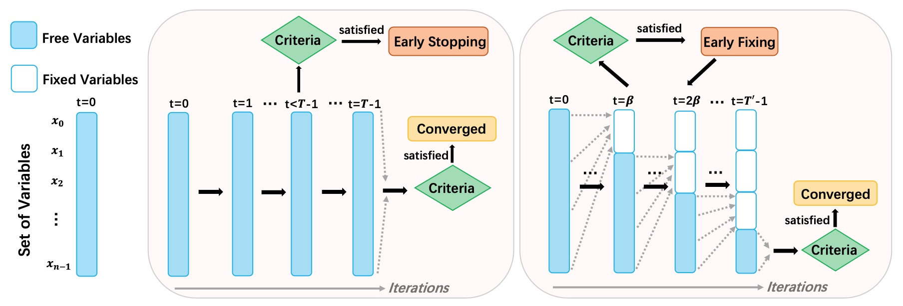

# Learning to Accelerate Approximate Methods for Solving Integer Programming via Early Fixing
This is the implementation for the paper "Learning to Accelerate Approximate Methods for Solving Integer Programming via Early Fixing". This work is an accelerated module as the extension of ["lp-Box ADMM: A Versatile Framework for Integer Programming"](https://ieeexplore.ieee.org/abstract/document/8378001). 

## Overview 

- In this work, we aim to acclerate the lp-Box ADMM method, which is an approximate method and versatile framework for solving Integer Programming (IP) problems. 
- We propose Early Fixing framework to accelerate the lp-Box ADMM method. 
- We formulate the whole early fixing process as a Markov decision process, and train it using imitation learning.
- Extensive experiments on our proposed early fixing framework are conducted to three different IP applications: constrained linear programming, image segmentation and sparse adversarial attack. The experiments reveal the competitiveness of our early fixing framework: the runtime speeds up significantly, while the solution quality does not degrade much. 



## Environment and installation

Our code is based on [Lpbox](https://github.com/wubaoyuan/Lpbox-ADMM/tree/master/cpp) and [Learn to stop](https://github.com/xinshi-chen/l2stop). We implement in C++ at bottom layer, then use Python at up layer through the [Cython interface](https://cython.readthedocs.io/en/latest/src/userguide/wrapping_CPlusPlus.html) for Exp1 and Exp2, and we use Python throughout Exp3. For all experiments, we use mha by default (with attention layers). You may also switch to mlp (without attention layers). 

Our environment is:

* CPU: Ryzen 5 2600
* Graphics Card: GTX 1070Ti
* Memory: 32GB
* Compiler: g++ 9.3.0
* Operating system: Ubuntu 20.04LTS
* Eigen library version: 3.3.8
* Opencv version: 4.4.0

First of all, install the `Eigen` and `unsupported` template library for all three experiments. Then install `opencv` for the image segmentation experiment. Follow the instructions [here](https://github.com/wubaoyuan/Lpbox-ADMM/tree/master/cpp) to install or run the quick start. 


## Installation
```sh
# quick start for installing the opencv.  
./install.sh 
```


## Experiment 1: Constrained linear programming 

```sh
# Part 1: install the module
cd EarlyFixing/LinearProgramming/  
pip install -e .  # install python library.

# Part 2: generate Combinatorial Auctions instances 
# According to:  Maxime Gasse et.al. "Exact Combinatorial Optimization with Graph Convolutional Neural Networks". NeurIPS, 2019. 
# The instance formulation is: 
#    argmax bx, s.t. Cx<=1.   
# Thus we record the b and C for each instance.   
cd LinearProgramming/generate_data
python generate_instances.py -n 120 -j 100 -k 500 # Generate 100 instances for training and 20 for testing. n-number of generated instances, j-item number(not equal but proportional to the constraint number), k-bid number(equal to variable number). 

# Part 3: build Cython 
cd ../cython_solver/data
mkdir log # save logs for each instances.
mkdir xiter # save iterative values and results for all instances.  
cd ../
make all # check if everything works fine. 
python setup.py build_ext --inplace 

# Optional testing in C++ and Python:
./test 1 100 500 # i,j,k refer to the instance index, bid number, item number.   
python test.py 

# Part 4: Network training
python get_iterations.py -n 120 -j 100 -k 500
cd ../experiments
./01_run_train.sh

# Part 5: Evaluations
./02_run_test.sh 
```

## Experiment 2: Image Segmentation
We choose the PASCAL Visual Object Classes Challenge 2012 datasets (VOC2012) for the experiments. We randomly pick 100,20,20 images for training, validation and testing. 
```sh
# Part 1: install the module 
cd EarlyFixing/Segmentation/
pip install -e .

# Part 2: build Cython, get iterations for training 
cd Segmentation/cython
mkdir data  # save images here.
mkdir xiter # save iterations for each image. 
mkdir result # save output images and logs. 
cd src/
make all
./image_segmentation  # get iterations for training.
/usr/bin/python3 setup.py build_ext --inplace # Important: choose the python where your opencv installed. For example, my python is /usr/bin/python3.

# Part 3: network training 
cp -r data ../    # reload the images for the training and validation. 
cd ../experiments
./01_run_train.sh

# Part 4: Evaluations
./02_run_test.sh 
```

## Experiment 3: Sparse Adversarial Attack
We aim to accelerate the sparse adversarial attack of ECCV'2020 paper. 
```sh
# Part 1: install the module 
cd EarlyFixing/SparseAttack/
pip install -e .

# Part 2: build Cython, get iterations for training 
cd SparseAttack/
mkdir data # obtain training images from CIFAR10. 
mkdir xiter # save iterations for training 
mkdir result # save logs. 
python generate_data.py # get iterations for training  

# Part 3: network training 
cd ./experiments
./01_run_train.sh

# Part 4: Evaluations
cd ..
python main_mha.py # testing with attention layers. lpbox ADMM + LEF
python main_mlp.py # testing without attention layers. lpbox ADMM + LEF
python main_ori.py # solve with lpbox ADMM 
```

## Acknowledgement and Related Work
We thank the following papers and source codes for giving us the inspirations and helps. 

- [1. Baoyuan Wu et. al. Lp-Box ADMM: A Versatile Framework for Integer Programming. TPAMI, 2018.](https://ieeexplore.ieee.org/document/8378001)
- [Github: https://github.com/wubaoyuan/Lpbox-ADMM](https://github.com/wubaoyuan/Lpbox-ADMM)

- [2. Xinshi Chen et. al. Learning To Stop While Learning To Predict. ICML, 2020.](http://proceedings.mlr.press/v119/chen20c.html)
- [Github: https://github.com/xinshi-chen/l2stop](https://github.com/xinshi-chen/l2stop)

- [3. Maxime Gasse et.al. Exact Combinatorial Optimization with Graph Convolutional Neural Networks. NeurIPS, 2019.](https://arxiv.org/abs/1906.01629) 
- [Github: https://github.com/ds4dm/learn2branch](https://github.com/ds4dm/learn2branch)

- [4. Yanbo Fan et.al. Sparse Adversarial Attack via Perturbation Factorization. ECCV, 2018.](https://www.ecva.net/papers/eccv_2020/papers_ECCV/papers/123670035.pdf) 
- [Github: https://github.com/wubaoyuan/Sparse-Adversarial-Attack](https://github.com/wubaoyuan/Sparse-Adversarial-Attack)
 
If you found these libraries useful in your research, please consider citing:
```sh
@article{wu2018ell,
  title={Lp-Box ADMM: A Versatile Framework for Integer Programming},
  author={Wu, Baoyuan and Ghanem, Bernard},
  journal={IEEE transactions on pattern analysis and machine intelligence},
  volume={41},
  number={7},
  pages={1695--1708},
  year={2018},
  publisher={IEEE}
}
@inproceedings{chen2020learning,
  title={Learning to stop while learning to predict},
  author={Chen, Xinshi and Dai, Hanjun and Li, Yu and Gao, Xin and Song, Le},
  booktitle={International Conference on Machine Learning},
  pages={1520--1530},
  year={2020},
  organization={PMLR}
}
@inproceedings{conf/nips/GasseCFCL19,
  title={Exact Combinatorial Optimization with Graph Convolutional Neural Networks},
  author={Gasse, Maxime and Chételat, Didier and Ferroni, Nicola and Charlin, Laurent and Lodi, Andrea},
  booktitle={Advances in Neural Information Processing Systems 32},
  year={2019}
}
@inproceedings{fan2020sparse,
  title={Sparse adversarial attack via perturbation factorization},
  author={Fan, Yanbo and Wu, Baoyuan and Li, Tuanhui and Zhang, Yong and Li, Mingyang and Li, Zhifeng and Yang, Yujiu},
  booktitle={European conference on computer vision},
  pages={35--50},
  year={2020},
  organization={Springer}
}
```